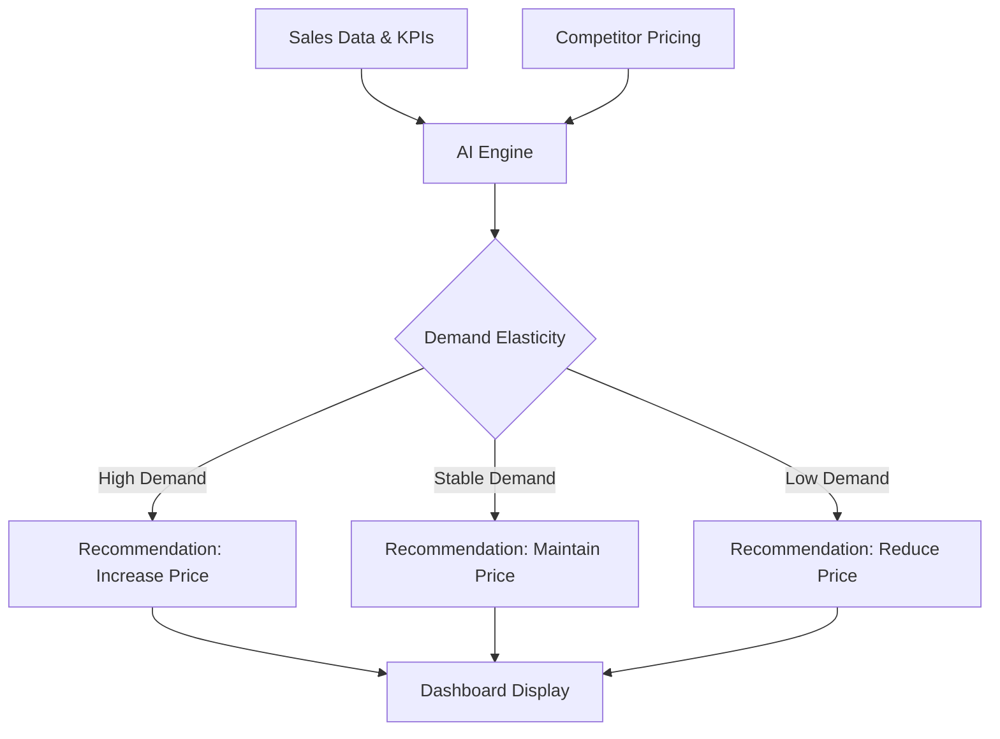
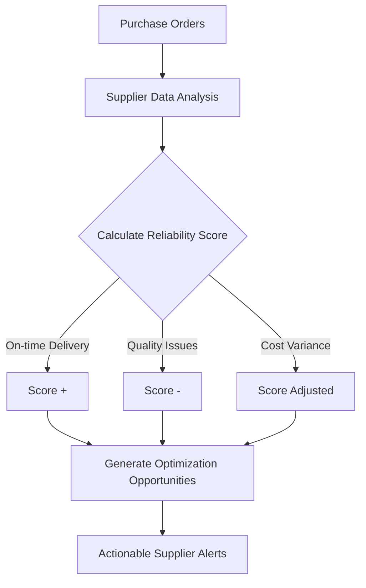
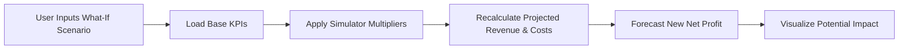

<div align="center">
  <h1>📈 AI-Powered SME Growth Advisor</h1>
  <p><strong>An Intelligent Business Operating System Powered by Gemma & FastAPI</strong></p>

  
  
  
  
  
  
</div>

<br />

## 📖 About the Project

**SME Growth Advisor** is a comprehensive, AI-driven business operating system designed specifically for Small and Medium Enterprises (SMEs). Powered by **Gemma** and **FastAPI**, this application provides a centralized dashboard for real-time cashflow management, pricing intelligence, and supplier advisory. It empowers business owners to optimize their operations, manage finances, and maximize growth with actionable, data-driven insights.

## ✨ Key Features

- 📊 **Real-Time Dashboard**: Comprehensive view of your business health, tracking Total Revenue, Net Profit, Cash Flow, and Pending Receivables.
- 🤖 **AI Advisor (Gemma)**: An integrated AI chat assistant to query business data, gain insights on sales, inventory, customers, and get personalized recommendations.
- 🏥 **Business Health Score**: Automated health assessment based on profitability, liquidity, operations, and growth metrics.
- 💰 **Pricing Advisor (AI)**: Analyzes demand elasticity and provides actionable recommendations for price adjustments to maximize profit.
- 🤝 **Supplier Intelligence**: Monitors supplier performance and identifies savings opportunities through smart recommendations.
- 🔮 **Growth Simulator**: Interactive "What-If" scenario planning to forecast the impact of business changes on net profit.
- 📦 **Inventory & Collections Management**: Automated alerts for low stock items and overdue payments to ensure smooth operations.

## 🛠️ Technology Stack

- **Frontend**: HTML5, CSS3, Vanilla JavaScript, Chart.js for interactive data visualization.
- **Backend**: Python 3.8+, FastAPI for robust and fast RESTful API endpoints.
- **Database**: SQLite, with automatic data initialization from CSV datasets (products, customers, suppliers, sales, etc.).
- **AI Integration**: Custom logic generating Gemma-style reasoning and insights based on real-time business KPIs.

## 📂 Project Structure

```text
├── index.html           # Main dashboard and application UI
├── app.js               # Frontend logic, charts, DOM updates, API integration
├── styles.css           # Custom styling, modern layouts, responsive design
├── api.py               # FastAPI backend (data endpoints, KPI computation, AI)
└── *.csv                # Sample datasets to initialize the SQLite database
```

## ⚙️ Setup and Installation

Follow these steps to run the project locally on your machine.

### Prerequisites

- **Python 3.8+** installed
- Modern Web Browser (Chrome, Firefox, Edge, etc.)
- Git

### Step-by-Step Installation

1. **Clone the Repository**
   ```bash
   git clone https://github.com/Kartikey-varshney206/AI-Powered-SME-Growth-Advisor.git
   cd AI-Powered-SME-Growth-Advisor
   ```

2. **Create a Virtual Environment (Optional but Recommended)**
   ```bash
   python -m venv venv
   # On Windows
   venv\Scripts\activate
   # On macOS/Linux
   source venv/bin/activate
   ```

3. **Install Backend Dependencies**
   ```bash
   pip install fastapi uvicorn pydantic requests
   ```

4. **Run the Backend Server**
   Start the FastAPI server using `uvicorn`:
   ```bash
   uvicorn api:app --reload --host 0.0.0.0 --port 8000
   ```
   *(Note: The `api.py` file automatically initializes the `sme_data.db` SQLite database from the included CSV files upon starting.)*

5. **Access the Frontend**
   Open a new terminal window, navigate to the project directory, and start a local HTTP server:
   ```bash
   python -m http.server 5500
   ```
   Then navigate to `http://localhost:5500/index.html` in your browser.

## 🔄 Architecture & Workflows

### 1. Pricing Advisor (AI) Flow


### 2. Supplier Intelligence Flow


### 3. Growth Simulator Flow


## 🌐 API Endpoints Overview

The backend provides various endpoints to fetch business data and insights:
- `GET /api/kpis` & `/api/kpis/summary`: Core business metrics and AI insights.
- `GET /api/sales`: Recent sales transactions.
- `GET /api/products` & `/api/inventory`: Product details and stock levels.
- `GET /api/customers` & `/api/pending-payments`: Customer profiles and overdue invoices.
- `GET /api/suppliers` & `/api/purchase-orders`: Procurement and supplier data.
- `POST /api/chat`: AI chat interface endpoint.
